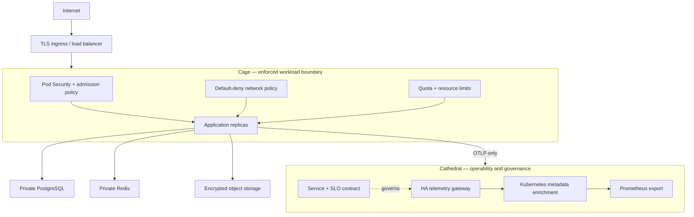

# Cage and Cathedral architecture

## Design laws

1. Nothing enters the Cage except through the named ingress path.
2. Nothing leaves the Cage except DNS, approved data services, HTTPS dependencies, and Cathedral telemetry.
3. A workload without identity, limits, health checks, and a service contract is incomplete.
4. The Cathedral observes the Cage but cannot mutate application resources.
5. Secrets never travel through ConfigMaps, container images, Git, or telemetry attributes.
6. Production changes are immutable-image rollouts backed by reviewed infrastructure plans.

## Trust boundaries

The public edge is untrusted. The Cage namespace is a restricted workload zone. Data services are private dependencies with distinct credentials. The Cathedral has read-only cluster metadata access solely to enrich telemetry. CI receives short-lived cloud credentials and is the only automated infrastructure mutation path.

## AWS/ECS mapping

The AWS deployment target implements the same split without Kubernetes objects. Its Cage is the private-subnet Fargate task, ALB-only ingress security group, data-service security group, read-only container root, scoped task role, and Secrets Manager injection. Its Cathedral is ECS Container Insights, CloudWatch logs and alarms, SNS notification, deployment health controls, and the documented service/SLO contract. The Kubernetes Cathedral adds the portable OTLP gateway when Kubernetes is the chosen runtime.

## Deployment order

1. Provision cloud foundations and data services.
2. Install a NetworkPolicy-capable CNI, ingress controller, and Metrics Server.
3. Apply the selected Kustomize overlay; it includes the Cage and Cathedral.
4. Create runtime and TLS secrets through their external controllers.
5. Deploy the application image and verify health, admission enforcement, telemetry, and SLO signals.
